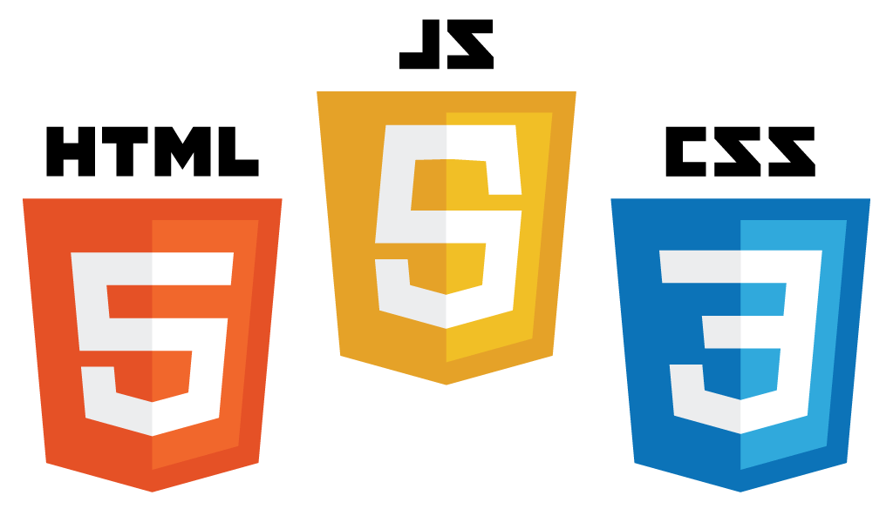

<h1 align="center" font-size="40px">

  
</h1>

<b>Next Level Week #02 | Discovery | Proffy🚀</b>
  

<h2>
&nbsp;A <b>Next Level Week</b> é um evento promovido pela <b>Rocketseat</b> que tem como objetivo pôr à prova as suas habilidades através do aprendizado e de demonstrações e desafios práticos, tudo com a finalidade de que o desenvolvedor alcance o próximo passo de sua evolução profissional.

&nbsp;Nesta segunda edição da NLW, na trilha Discovery, voltada a principiantes, o participante se depara com o desenvolvimento de uma plataforma de estudos online chamada <b>Proffy</b>.</h2>

<h2>&nbsp;É um projeto que coloca em prática diversos conceitos fundamentalmente importantes e atuais do <i>Web Development</i>, tais como...</h2>
  

 
<h3><b>Design Responsivo - Mobile First 📱</b></h3>

  

 
<h3><b>Código Moderno - HTML, CSS e JavaScript Atuais ✔️</b></h3>

  

<h2>...dentre diversos outros experimentos práticos também no Back-End 🔗, como construir servers e linkar dinamicamente dados e database!
  
A Next Level Week #02 acontece entre os dias 3 e 9 de Agosto.
</h2>  

- Este projeto encontra-se sob a licença MIT.
